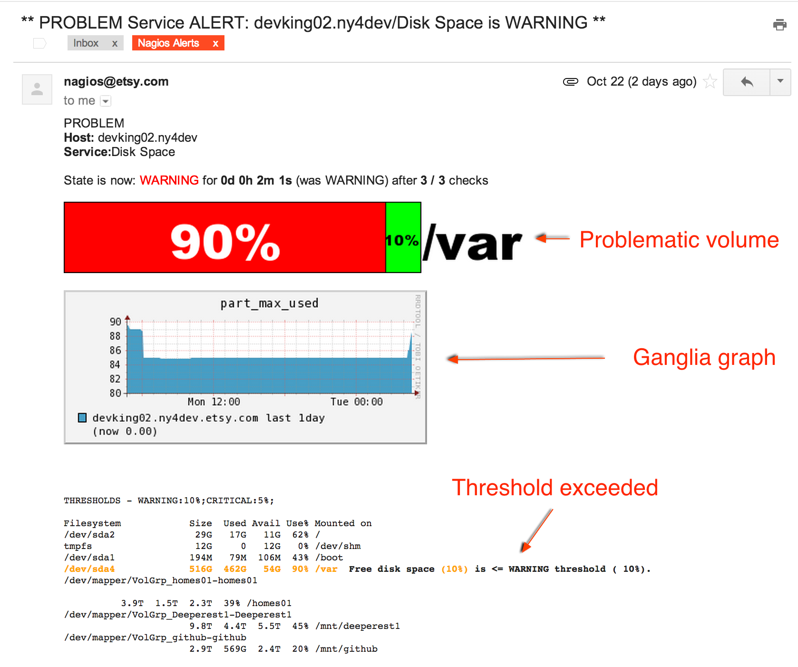

# nagios-herald

``nagios-herald`` is a set of scripts and libraries that allows Nagios to send alerts with arbitrary
context and customized formatting.

At its core, ``nagios-herald`` is made up of the ``notify-by-handler`` script that sources
functionality from its formatter libraries.  The formatter libraries can generate **stack bars**,
inline dynamic **Ganglia graphs** (and Graphite soon), **highligh/colorize text**, and much more.

Nagios generates alerts by calling the ``notify-by-handler`` script as defined in Nagios' ``commands.cfg``
file.

## Why Customize Nagios Alerts?

Nagios is a good tool for monitoring infrastructure, determining when a host or service check has exceeded
a given threshold and sending alerts.  The messages it can send when an alert is triggered are fairly
vanilla and provide the bare minimum information (i.e. Host 'foo' is DOWN).  When a page is received,
an engineer typically performs a set of procedures to gather more information about the event before
attempting to correct it.  Wouldn't it be great to have that context in the alert?

Luckily, we live in the age of computers; they can do the work for us!  Rather than spend time gathering
information, let's put the relevant context in the alert.  This is especially important when one is on call
and gets paged at 3AM.

Enter ``nagios-herald``!

### Vanilla Nagios Alert

A typical example of a Nagios alert comes from the canonical disk space check, an example of which is below:

While it does provide necessary information, it could be formatted for better readability.  For example,
the following line, which contains the information we need, is dense and may be difficult to
parse in the wee hours of the morning:

    Additional Info: DISK WARNING - free space: / 1597 MB (8% inode=57%):
    /dev/shm 24127 MB (100% inode=99%): /boot 152 MB (83% inode=99%):

Common questions would be **"Which volume is problematic?"** and
**"Why is this considered a 'WARNING' alert?"**  In this example, it's not readily apparent what
those answers are.  Let's add that context with ``nagios-herald``.

### Nagios Alert with Context

With ``nagios-herald``, alerts can provide arbitrary context.  For example, graphs and data that
an engineer might refer to can be embedded and/or formatted in the email alert.

The previous disk space alert example can be tailored to look like this:

Notice the handy **stack bar** that clearly illustrates the problematic volume?  See that **Ganglia graph**
showing disk space utilization for the node in the last 24 hours. Curious why the alert fired?  Check
the **highlighted ``df`` output** that neatly defines which threshold was exceeded and why.

This is possible due to ``nagios-herald``'s formatter libraries.

It **slices**!  It **dices**!  **Julienne**?  No problem.

What **can't** ``nagios-herald`` do?  Only what your **imagination** hasn't thought up yet.  Want to
write your own formatter?  Let's get started.

## Formatters

Adding context to alerts is done by the formatters.  Formatters are where all the fun happens.

### Directory Hierarchy

``nagios-herald`` has a familiar directory structure; scripts live in ``bin/``, config lives in
``etc/``, libraries live in ``lib/nagios-herald``, and tests (yes, tests!) live in ``tests/``.  Here's an overview of the
structure, for reference.

    ── bin
      ├── draw_stack_bars
      ├── dump_nagios_env.sh
      ├── get_ganglia_graph
      ├── get_graph
      ├── notify-by-handler
      ├── send_html_email
      └── splunk_alert_frequency
    ── etc
      ├── config.yml
      ├── config.yml.example
      └── readme.md
    ── lib
      ├── nagios-herald
      │  ├── configuration_manager
      │  │  ├── base.rb
      │  │  ├── chef.rb
      │  │  └── simple.rb
      │  ├── configuration_manager.rb
      │  ├── email_message.rb
      │  ├── engine.rb
      │  ├── exec.rb
      │  ├── formatters
      │  │  ├── check_disk.rb
      │  │  └── default_formatter.rb
      │  ├── helpers
      │  │  ├── ganglia_graph.rb
      │  │  ├── splunk_alert_frequency.rb
      │  │  └── url_image.rb
      │  ├── logging.rb
      │  ├── util.rb
      │  └── version.rb
      ├── nagios-herald.rb
    ── tests
    ├── assertions.rb
    ├── env_files
    ├── integration
    │   └── default_formatter_test.rb
    ├── mock_email_message.rb
    └── run_tests.rb

### Writing the Formatter

When called, the ``nagios-herald`` invokes various formatting functions on a formatter class
(that you'll write) and falls back on the default formatter class for any methods that your formatter
does not override.  The methods available to be overridden are:

    format_ack_info
    format_additional_details
    format_additional_info
    format_alert_ack_url
    format_host_info
    format_notes
    format_notification_info
    format_recipients_email_link
    format_short_ack_info
    format_short_state_detail
    format_state_detail
    format_state_info

All of these methods are defined in the ``DefaultFormatter`` class located at
``/lib/nagios-herald/formatters/default_formatter.rb``.

To begin writing your own formatter, create a new create a new Ruby file that inherits from ``NagiosHerald::Formatter::DefaultFormatter``.  
This file will define the formatter class you intend to write.  The file and class should follow a specific naming convention:

* The class name is camel-cased.
* The class file name is lower-cased and uses underscores between words.

As an example, a formatter used for providing context for disk space checks would have a class name of
``CheckDisk`` and the class file would be named ``check_disk.rb``.  This is a typical Ruby pattern and one
that is enforced in ``nagios-herald`` via code that imports classes based on the class file name.

1. Create your formatter and extend the ``NagiosHerald::Formatter::DefaultFormatter`` class:

        module NagiosHerald
          module Formatter
            class CheckDisk < NagiosHerald::Formatter::DefaultFormatter
              include NagiosHerald::Logging

              (override various methods here)

            end
          end
        end

2. Override the sections you want to customize.

    You can define the text and/or HTML content in a message by calling the ``add_text`` and ``add_html`` methods
    inside a formatting method:

        add_text "Something blew up!"
        add_html "Something <b>blew</b> up!"

    An example of an overridden ``format_additional_info`` method could be:

        def format_additional_info()
            hostname  = get_nagios_var("NAGIOS_HOSTNAME")
            add_text "The hostname is #{hostname}"
            add_html "The hostname is <b>#{hostname}</b>"
        end

3. Optional: Inline static images in the message.

Call the ``add_attachment`` method and specify the full path to the image file to be attached.
The mailer will then inline the image in the HTML body of the message.

    partitions_chart = "/path/to/partition_chart.png"
    add_attachment partitions_chart
    add_html ""

4. Optional: Attach documents to the message.

Call the ``add_attachment`` method and specify the full path to the document to be attached.  **Done**.

    add_attachment "/path/to/file.zip"

5. Optional: use the NagiosHerald helpers to retrieve additional data (see [check_disk formatter](https://github.etsycorp.com/Sysops/nagios-herald/blob/master/lib/nagios-herald/formatters/check_disk.rb) for more details)

    NagiosHerald::Helpers::GangliaGraph
    NagiosHerald::Helpers::SplunkReporter

6. When configuring nagios to use your formatter, do not forget to specify the formatter-dir option (--formatter-dir)

### Defining Formatting Based on Alert Types and Delivery Method

``nagios-herald`` can respond to 5 types of Nagios alert:

* ACKNOWLEDGEMENT
* FLAPPINGSTART
* FLAPPINGSTOP
* PROBLEM
* RECOVERY

``lib/nagios_herald/engine.rb`` defines what content is generated, based on the alert type and delivery method.

Depending on whether an alert is sent in pager or email mode, content is written as follows:

``PROBLEM`` and ``FLAPPING_START``

    pager:
        format_short_state_detail
    email:
        format_host_info
        format_state_info
        format_state_detail
        format_additional_info
        format_additional_details (for services only)
        format_recipients_email_link
        format_notification_info
        format_alert_ack_url

``RECOVERY`` and ``FLAPPING_STOP``

    pager:
        format_short_state_detail
    email:
        format_host_info
        format_state_info
        format_state_detail
        format_additional_info
        format_additional_details (for services only)
        format_recipients_email_link
        format_notification_info

ACKNOWLEDGEMENT

    pager:
        format_short_ack_info
    email:
        format_host_info
        format_ack_info

### A Note About Nagios Data

Nagios stores important information in environment variables.  The formatter methods can retrieve that
information by using the ``get_nagios_var()`` method.  For reference, see
[example](https://github.etsycorp.com/Sysops/nagios-herald/blob/master/tests/env_files/nagios_vars). Do not directly call
``env['YOUR_VAR']`` in your Ruby code as it will be harder to test.

## Testing Your Formatter

**PLEASE PLEASE TEST YOUR FORMATTER.  NOT DOING SO INCREASES THE POSSIBILITY THAT A NEW FORMATTER WILL PREVENT
DELIVERY OF CRITICAL ALERTS.  TEST.  PLEASE.**

``notify-by-handler`` can be called manually from the command line to test new formatters:

The help menu can be accessed via the -h --help flags

    [rfrantz@toolbox.ny4 ~/git/nagios-herald] $ bin/notify-by-handler --help
    Usage: notify-by-handler [-cdefnrpuy]
    Nagios handler

        -c, --config-file                Specify an alternate location for the config file.
        -d, --debug                      BE VERBOSE! B-E V-E-R-B-O-S-E!
        -e, --env-file                   Path to a file containing environment variables to use for testind/debugging (i.e. nagios_vars).
        -f, --formatter                  Formatter name
            --formatter-dir              Formatter directory
        -n, --notification_type          NAGIOS_NOTIFICATION_TYPE to report - defaults to the nagios env variable.
                                         Valid options: PROBLEM, FLAPPINGSTART, RECOVERY, FLAPPINGSTOP, ACKNOWLEDGEMENT
        -r, --recipient                  A recipient's email address. Specify multiple recipients with multiple '-r' arguments.
                                         If not specified, recipients are looked up in the ENV['NAGIOS_CONTACTEMAIL'] environment variable.
        -p, --pager                      Enable pager mode
        -u, --nagios-cgi-url             Nagios CGI url (used for acknowledgement links)
        -y, --reply-to                   [REQUIRED] Reply-to email address (i.e. nagios@etsy.com) used for acknowledgement replies.
            --no-email                   Output email content to screen but do not send it.
            --configuration-manager      Configuration Management Tool
                                         Valid options: simple, chef
            --trace                      Show a full traceback on error

    EXAMPLES
    --------
    notify-by-handler -r rfrantz@etsy.com --env-file=tests/env_files/nagios_vars -y nagios@etsy.com --formatter=check_disk --configuration-manager simple

### Configuration Manager

Nagios Herald formatters may neeed to access information about your infrastructure, such as the cluster name for a given host. The default
configuration manager is chef, but you may not be using chef or may not have chef installed. In such case, use the 'simple' configuration manager that does not have any dependencies.

### Testing the Formatter with Offline Data

Because Nagios stores information in environment variables that are generated during runtime, this project
provides a few files that can be used for testing.  Any ``nagios_vars*`` file can be specified via the
``--env-file`` argument to mimic an alerting event.  During normal operation ``nagios-herald`` grabs
the information it needs from Nagios' environment variables.

**NOTE**: When using the ``--no-email`` argument, the text version of the email is displayed on the
console, and the HTML content is saved in a file (``mail.html``).

    ./bin/notify-by-handler --no-email --env-file=tests/env_files/nagios_vars --formatter=check_disk
    Email text content
    ------------------
    Subject : ** PROBLEM Service ALERT: nkammah.vm.ny4dev/Disk Space is SERVICE **
    ------------------
    PROBLEM Host: nkammah.vm.ny4dev
    Service:    Disk Space

    State is now: CRITICAL for 0d 0h 5m 12s (was CRITICAL) after 3 / 3 checks

    Additional info:
     DISK CRITICAL - free space: / 7002 MB (18% inode 60%): /data 16273093 MB (26% inode 99%):

    Additional Details:
    Filesystem            Size  Used Avail Use% Mounted on
    /dev/vda               40G   31G  6.9G  82% /
    tmpfs                 2.5G   83M  2.4G   4% /dev/shm
    nfs01.ny4dev.etsy.com:/mnt/data/homes
                           59T   43T   16T  74% /data

    Sent to nkammah
    Notification sent at: Thu May 16 21:06:38 UTC 2013 (notification number 1)

    Acknowledge this alert: http://nagiosny4dev.etsycorp.com/nagios/cgi-bin/cmd.cgi?cmd_typ=34&host=nkammah.vm.ny4dev&service=Disk%20Space%0A%3Cbr%3E
    ------------------
    Email html content saved as mail.html

## Deploying Updates

It couldn't be easier to roll out changes (like a new formatter) to ``nagios-herald``.  A
[Deployinator stack](http://deployinator.etsycorp.com/nagiosemailhandler) is available to push updates to all
Nagios instances.  You know what to do.

## Nagios Configuration

Now,for the good stuff.  Once your formatter is created and tested (please test), add the
``_email_formatter_name`` custom variable in the ``services.cfg`` config file for the check you want
the formatter to run.  Its value should be the name of the formatter.  An example configuration
stanza is below:

    define service {
            use                             generic-service
            host_name                       devmysql03.ny4dev
            service_description             Disk Space - Hackweek 2013
            check_interval                  60  ; every hour
            check_command                   check_nrpe!check_disk_frantz
           _email_formatter_name            check_disk
    }

## Tools

The repository comes with a few tools you can use to provide additional context to your formatter.  These are
really useful for testing functionality outside of ``notify-by-handler``.

### Stack Bars ``bin/draw_stack_bars``

Stack bars can be useful for visualizing disk utilization.

    $ ./bin/draw_stack_bars -h
    usage: draw_stack_bars [options] label=value label=value

    options:
      -h, --help            show this help message and exit
      -w WIDTH, --width=WIDTH
                            Picture width
      -o OUTPUT_FILE, --output=OUTPUT_FILE
                            The file name to save the results in
      --bar-area-ratio=BAR_AREA_RATIO
                            How wide should the bar area be compared to the total
                            width
      --bar-height-ratio=BAR_HEIGHT_RATIO
                            How tall should the bars be compared to their width
      --bar-border=BAR_BORDER
                            Width of the border around the bars

For example: **./bin/draw_stack_bars /var=10** will generate:

### Ganglia Graphs ``bin/get_ganglia_graph``

    $ ./bin/get_ganglia_graph -h
    Usage: get_ganglia_graph [-hmpr]

    get_ganglia_graph is used to generate images from Ganglia graphs.

    It takes one or more hostnames and a single metric to build the appropriate URI(s) from which to generate images.
    The script outputs the full path for each of the images that have been written.

        -h, --host *HOST                 The FQDN of the host required to look up a metric/image in Ganglia. Specify multiple hosts with multiple '-h' arguments.
        -m, --metric                     The name of the metric we want to see.
        -p, --path                       An optional path in which to write the image files.
                                         DEFAULT: /tmp
        -r, --range                      The range of time for which the graph should look back.
                                         Acceptable values are the same as thouse used by Ganglia (i.e '8hours', '8h, '1day', '1d', '3weeks', '3w')
                                         DEFAULT: 8h (8 hours)

    EXAMPLES
    --------
    1. Passing a single hostname and metric to get_ganglia_graph:

        get_ganglia_graph -h dbshard12.ny4.etsy.com -m part_max_used

    2. Passing multiple hostnames and a metric to get_ganglia_graph:

        get_ganglia_graph -h dbshard12.ny4.etsy.com -h memcached01.ny4.etsy.com -m disk_free

    3. Including an optional time range (12 hours):

        get_ganglia_graph -h dbshard12.ny4.etsy.com -h memcached01.ny4.etsy.com -m disk_free -r 12h

**NOTE**: Formatters can inline Ganglia graphs by calling the ``generate_ganglia_graphs()`` method,
imported from the ``lib/ganglia_graph.rb`` library.

# Dependencies

## Ruby Gems

``nagios-herald`` and its tools depend on the following Ruby gems:

* ``app_conf``
* ``choice``
* ``mail``

The above gems are installed on all Nagios instances via Chef.

## Ganglia Graphs

In order to pull graphs from Ganglia, each Nagios instance needs to be able to query Chef.  Proper Chef keys
and configuration are managed on every Nagios instance by, well, Chef.

## Stack Bars

Generating stack bars requires the following (which are included in this project for your convenience):

* Python
* Python Image Library (PIL)
